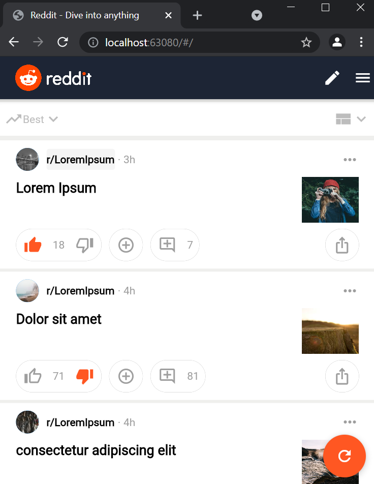

# Tugas 2 - Reddit Bootleg

Pada tugas ke-2 ini saya mengambil referensi dari laman utama website Reddit versi tampilan mobile.

## Sekilas Tentang Reddit
Dikutip dari Wikipedia, Reddit adalah situs web hiburan dan juga berita tempat pengunjung yang telah terdaftar dapat berkontribusi dalam bentuk memberikan posting pranala atau teks. Pengunjung lain dapat memberikan suara "atas" atau "bawah", yang kemudian akan dihitung untuk memberikan peringkat posting tersebut, yang menentukan posisinya dalam halaman situs web. Isi situs dibagi berdasarkan tema, yang dinamakan "subreddit".

## Screenshot

## Widget Terimplementasi

✅ AppBar ✅ Text ✅ Column ✅ Row

✅ Container ✅ Image ✅ FloatingActionButton

✅ IconButton ✅ TextButton ✅ ListView ✅ Expanded
