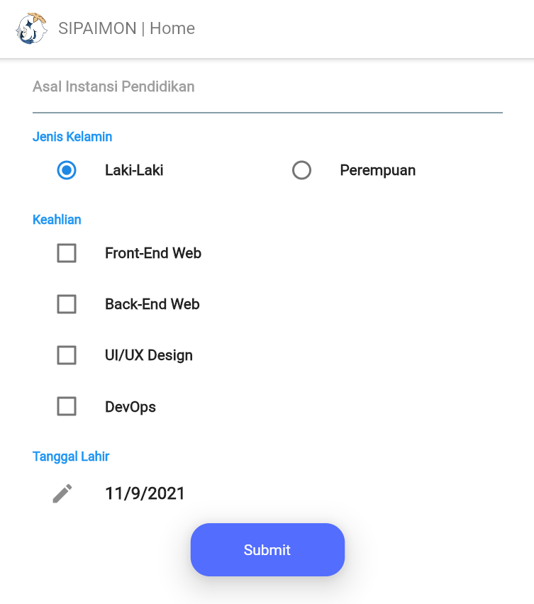
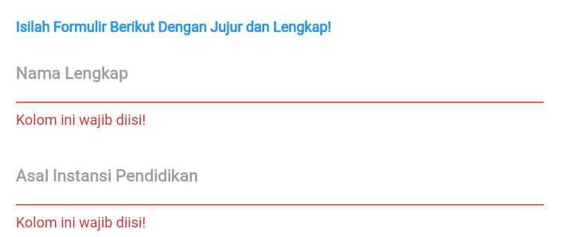
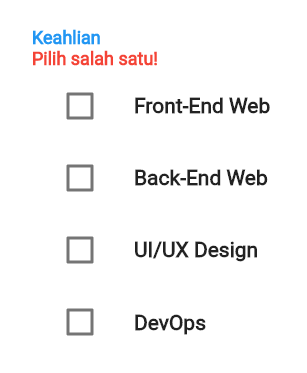
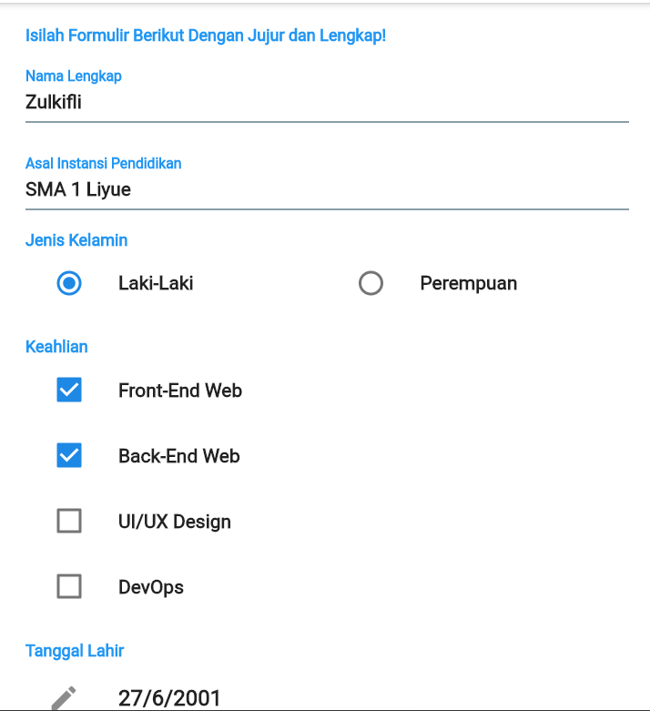
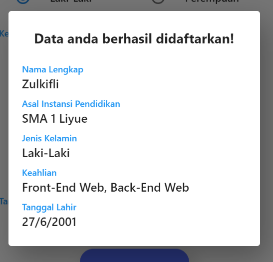

# Tugas 3 - Form PT.Vision

Pada tugas ke-3 ini saya membuat formulir sederhana yang berfungsi untuk mendata pegawai magang di perusahaan fiksi bernama PT.Vision.

## Struktur Form
#### Nama Lengkap ・ TextFormField
#### Asal Instansi Pendidikan ・ TextFormField
#### Jenis Kelamin ・ RadioListTile
#### Keahlian ・ CheckboxListTile
#### Tanggal Lahir ・ DatePicker

## Screenshot

    

        <h4>Tampilan Awal Bagian 1</h4>
        
    

    

        <h4>Tampilan Awal Bagian 2</h4>
        
    

    

        <h4>Tampilan Invalid Bagian 1</h4>
        
    

    

        <h4>Tampilan Invalid Bagian 2</h4>
        
    

    

        <h4>Tampilan Terisi</h4>
        
    

    

        <h4>Tampilan Tersubmit</h4>
        
    

