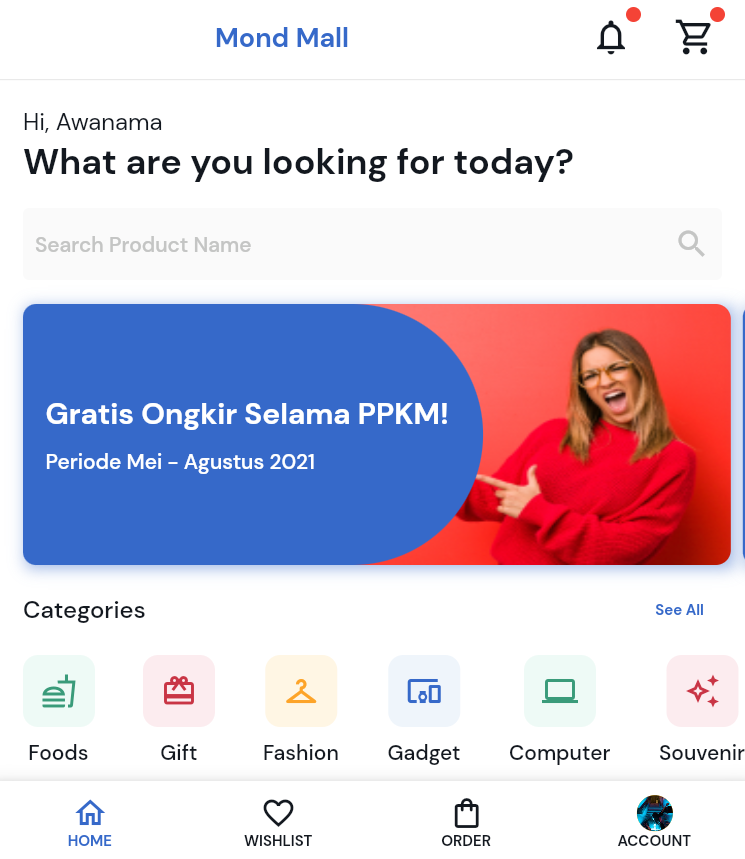
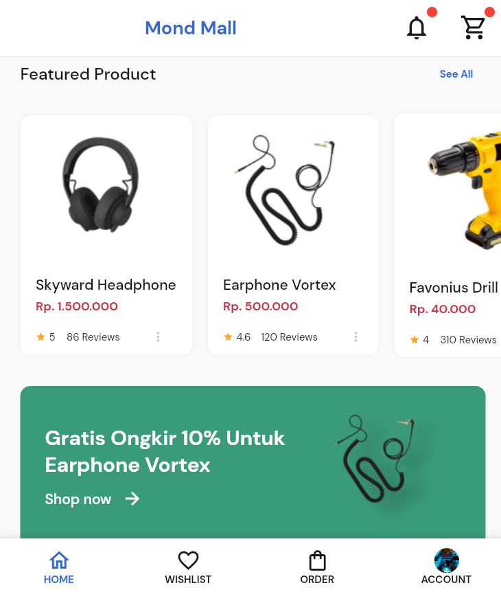
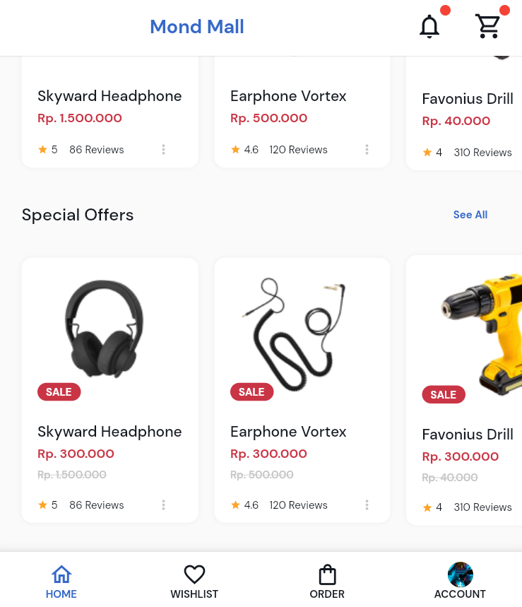

# 

Pada tugas ke 2 yang ke 2 kalinya ini, saya melakukan slicing terhadap desain situs e-commerce yang saya temukan di [Figma](https://www.figma.com/community/file/1020869651724237430).

## Struktur Folder
### models
Menyimpan model data yang terdiri dari Category dan Product.
### styles
Berisi style teks dan warna yang digunakan dalam aplikasi ini.
### utils
Berisi fungsi trivial yang digunakan untuk kebutuhan tertentu.
### views
Berisi laman yang ditampilkan dalam aplikasi.
### widgets
Menampung berbagai komponen widget yang digunakan.

## Screenshot

    

        <h4>Tampilan Bagian Intro</h4>
        
    

    

        <h4>Tampilan Bagian Karosel Produk & Banner Produk</h4>
        
    

    

        <h4>Tampilan Bagian Karosel Produk Obral</h4>
        
    

