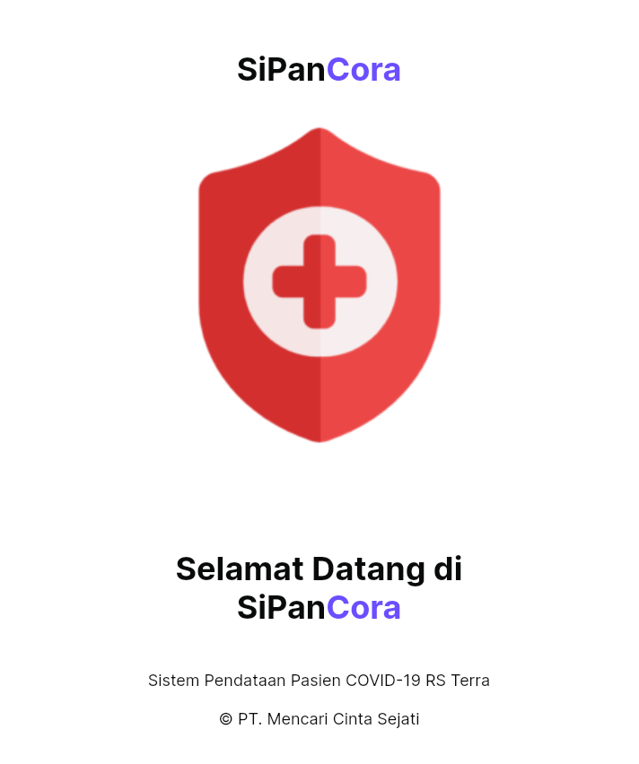
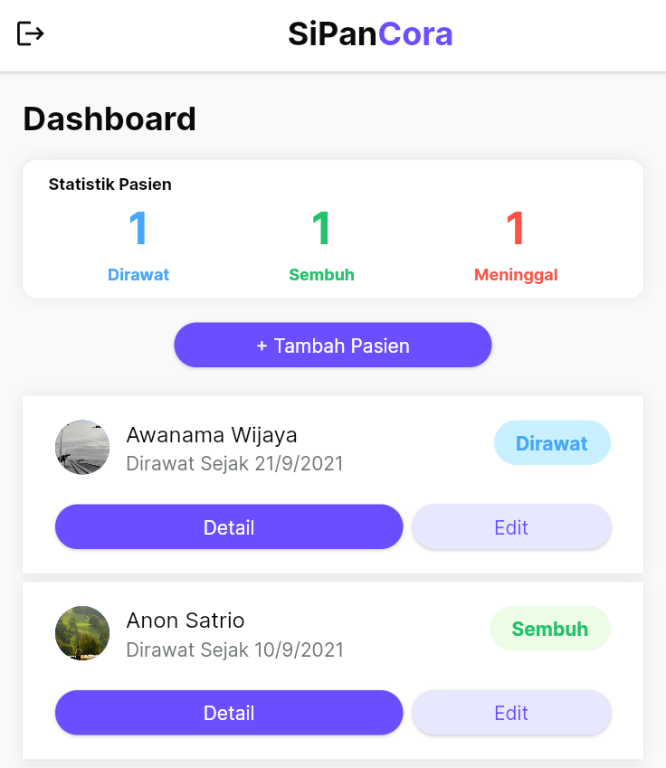
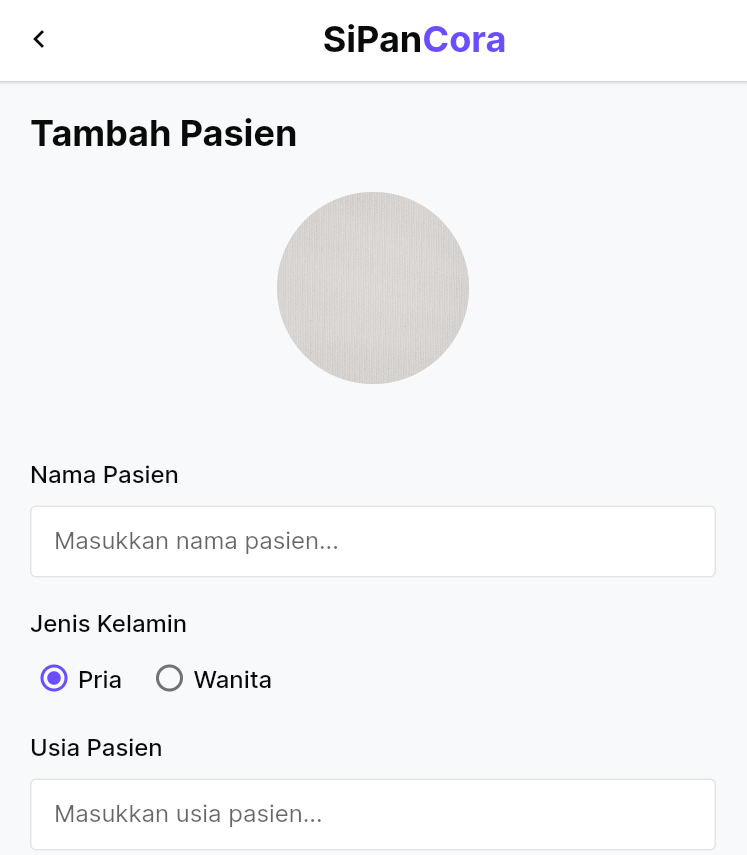
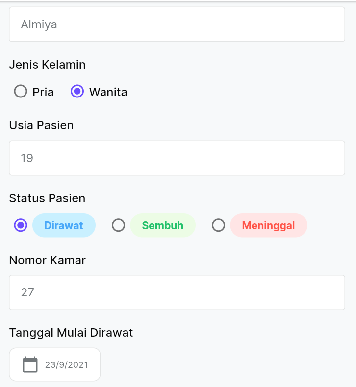
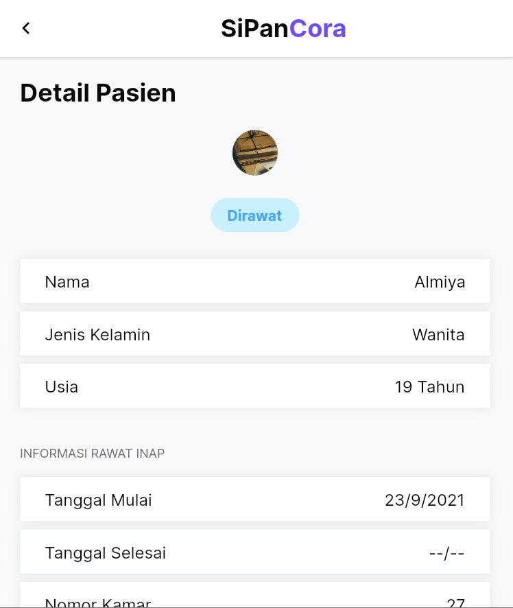
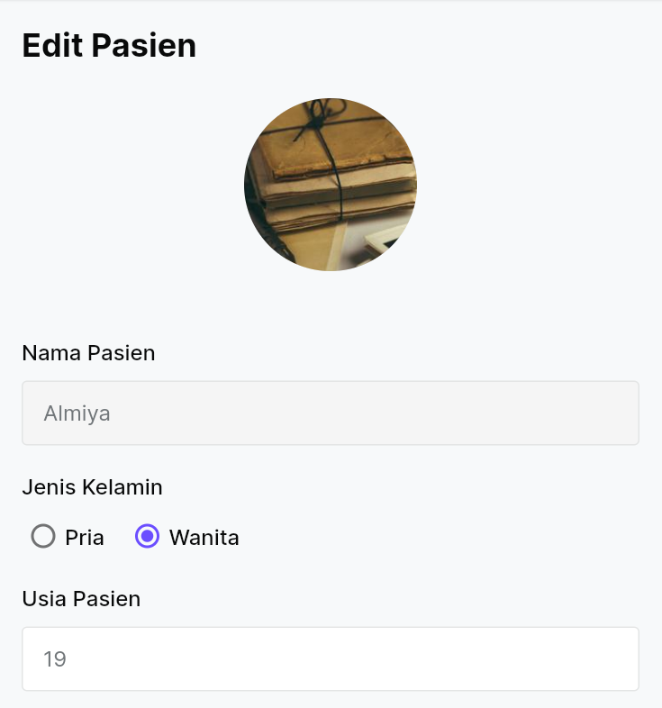
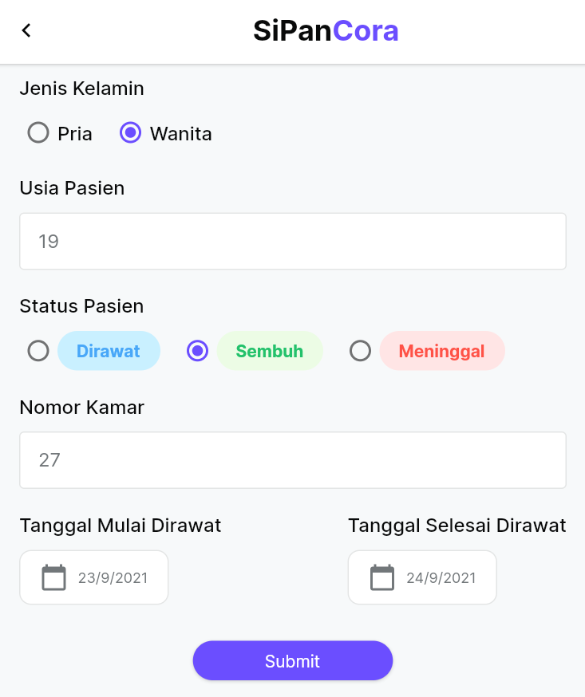

# Tugas 4: Sistem Pendataan Pasien COVID-19 RS Terra (SIPANCORA)

Pada tugas 4 ini saya membuat sebuah aplikasi pendataan pasien yang dapat melakukan aktivitas Create, Read, dan Update. Pengguna dapat menambahkan, merubah, atau melihat detail dari pasien yang telah ditambahkan. Untuk desainnya saya mengambil beberapa komponen dari [UI Kit Nucleus | Figma](https://www.figma.com/community/file/967227093809940846).

## Struktur Folder
### models
Menyimpan model data yang terdiri dari Patient, PatientList, dan PatientScreenArguments (untuk kebutuhan navigasi).
### styles
Berisi style teks dan warna yang digunakan dalam aplikasi ini.
### views
Berisi laman yang ditampilkan dalam aplikasi.
### widgets
Menampung berbagai komponen widget yang digunakan.

## Screenshot Laman

    

        <h4>Tampilan Bagian Splash Screen</h4>
         
        <a>Ditampilkan selama beberapa detik saat memulai aplikasi</a>
    

    

        <h4>Tampilan Bagian Dashboard</h4>
         
        <a>Ditampilkan statistik pasien berdasarkan statusnya (dirawat, sembuh, atau meninggal) dan daftar pasien yang telah ditambahkan ke dalam aplikasi</a>
    

    

        <h4>Tampilan Bagian Tambah Pasien</h4>
         
         
        <a>Dari laman dashboard dapat beralih ke laman penambahan pasien, disediakan form kosong tanpa data untuk diisikan data pasien yang ingin ditambahkan. (foto pasien diatur secara random menggunakan API lorempicsum)</a>
    

    

        <h4>Tampilan Bagian Detail Pasien</h4>
         
        <a>Dari laman dashboard dapat beralih ke laman detail pasien yang menampilkan informasi data pasien yang telah ditambahkan.</a>
    

    

        <h4>Tampilan Bagian Edit Pasien</h4>
         
         
        <a>Dari laman dashboard dapat beralih ke laman perubahan pasien, disediakan form dengan data pasien yang dipilih untuk dirubah.</a>
    

